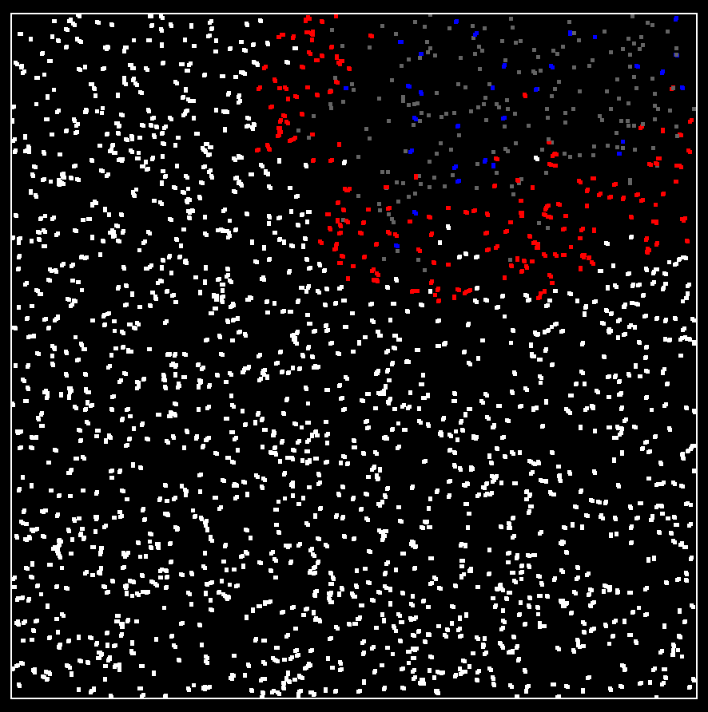
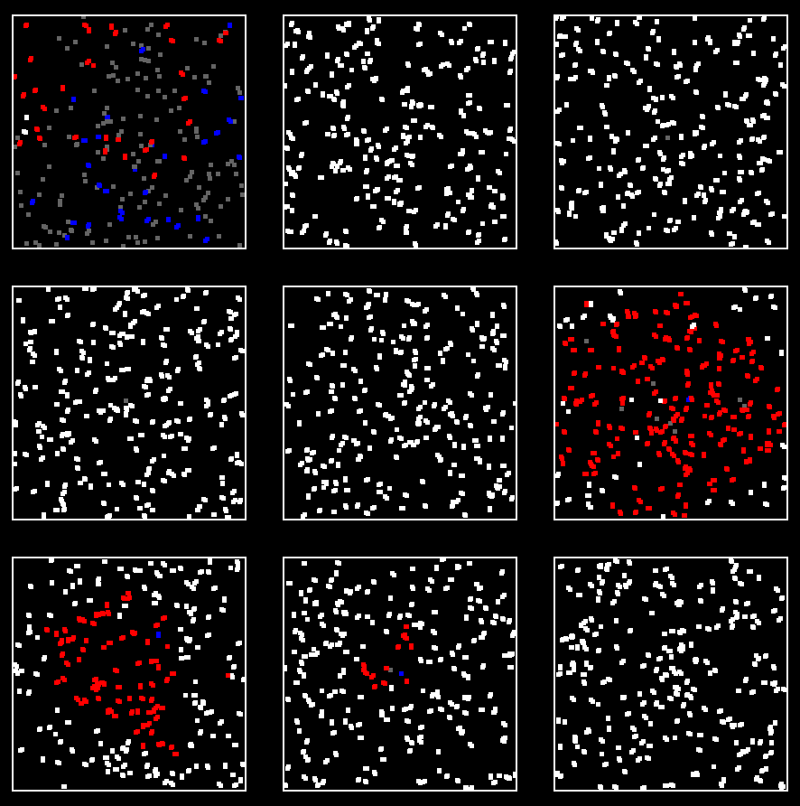

# Epidemic
Simulate an epidemic and watch a disease spread in a population

  
   

### Requirements:
numpy and pygame need to be installed.

### How to use:
Simply run the script. There are a whole lot of parameters at the start of the file that can be adjusted, such as infection risk, lethality, recovery time, immunity etc.
